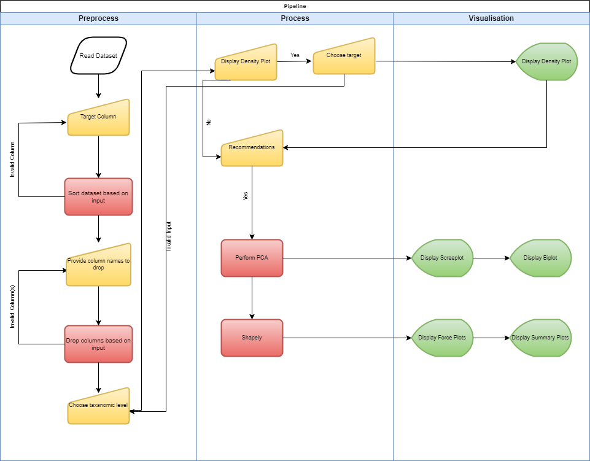

# A software to increase machine learning interpretability

# Table of Contens
1. [Description](#Description)
2. [Data](#Data)
3. [Usability](#Usability)
4. [Installtions](#Installations)
5. [Software](#Software)
6. [Visualisations](#Visualisations)


# Description
The advent of  machine  learning has unlocked various novel  possibilities  in  various scientific  disciplines  and society.  This has  however  lead  to the  development  of increasingly complex machine learning algorithmswith higher accuracy,butconsequentially resulted ina lack of understanding the computational processesthat are at play.  This phenomenonhampers  the  incorporation  of machine  learninginto  research  and  societyand could prevent further  advances  in  many  disciplines.SHAP (shapley  additive  explanations)  is  a  novel  machine learning  algorithm  that supposedly  increases  machine learning interpretabilityand could potentially tackle this issue.This study developed a pipeline which allows the evaluation  of common complex  machine  learning approaches   (e.g.   XGboost,   Gradient   boosing   and Elasticnet) by   SHAPin  an   attempt   to   tackle   this problem. Gut microbiome omics data was the focus of the pipeline,   which enables   the   user   to   opt   for specialized   microbiome   omics   data preprocessing options. The  initial  aim  of  this  study  was  to  evaluate whether the  developed  pipeline  would indeed increase machine learning interpretability through a stakeholder questionnaire.This  has  however  not  been  conducted due to time constraints. Additional features need to be implemented   (e.g.   benchmarking,   classification, an improved   user-interface) shouldthe   softwarebe presented to stakeholders. Further studies are advised tofollow-up on theseshortcomings


## Data
Data has been collected and anonymized by the researchers at the UMCG. 

Data used in this project comes from already published studies and therefore data has been collected and has been made publicly available. Datasets used in this project are the following: 

-  Microbiome data: Proportions of bacteria abundances and microbial pathways from 1179 stools samples from the LifeLines-Deep cohort at the European Genome-phenome Archive under accession EGAS00001001704. 

- Metabolomics: blood metabolites measured using targeted metabolomics.  

- Proteomics: https://www.olink.com  

The gut microbiome data is collected by deep sequencing the gut micro biomes of 1135 Dutch participants, gathered from 1179 stool samples from lifelines-DEEP participants. The gut microbiome was analysed using a HiSeq2000, conducting a paired-end metagenomic shotgun sequencing (MGS). 
Using MetaPhlAn 2.0 , the microbiome sequence reads were mapped to ~1 million microbial-taxonomy- specific marker genes. The main goal of the data is to find correlations between dietary intake and diseases. In addition, metabolomics, proteomics and some anthropometric data has been gathered.
More information about the data collection can be found [here](https://ega-archive.org/studies/EGAS00001005027). 
The LifeLines-DEEP meta genomics sequencing data are freely available online. 

# Usability


# Software Requirements

All of the code was written in [python 3.8.13](https://www.python.org/downloads/release/python-3813/).
In addition, several modules were used in order for the code to gain proper functionality. Some packages are default 
packages in python, and these will not be mentioned here. These packages are available in the supplementary materials
in the project paper.

| Package                                                                       | Version | Usage                                                         |
|-------------------------------------------------------------------------------|---------|---------------------------------------------------------------|
| [sklearn](https://scikit-learn.org/stable/supervised_learning.html)           | 1.0.2   | Used to implement several  machine learning algorithms.       |
| [Numpy](https://numpy.org/)                                                   | 1.21.5  | Uses for several calculations                                 |
| [shap](https://shap.readthedocs.io/en/latest/index.html)                      | 0.39.0  | Used to calculate and visualise shapely values                |
| [xgboost](https://xgboost.readthedocs.io/en/stable/)                          | 1.5.0   | Used to perform the xgboost algorithm on the data             |
| [pandas](https://pandas.pydata.org/docs/)                                     | 1.4.2   | Used to read data in the Preprocess module                    |
| [re](https://docs.python.org/3/library/re.html)                               | 2.2.1   | Used to drop specific columns in the Preprocess module        |
| [IPython](https://pypi.org/project/ipython/)                                  | 8.3.0   | Used for it's display function                                |
| [pca](https://pypi.org/project/pca/)                                          | 1.8.2   | Used to perform pca and construct the scree and bi plot       |
| [pathlib](https://docs.python.org/3/library/pathlib.html)                     | 2.3.6   | Used to write constructed plots to file given a specific path |
| [composition_stats](https://pypi.org/project/composition-stats/)              | 1.40-1  | Used for many functions in the Preprocess module              |
| [matplotlib](https://matplotlib.org/)                                         | 3.5.1   | Used to create a variety of plots                             |
| [pickle](https://docs.python.org/3/library/pickle.html)                       | 4.0     | Used to read the pickled data                                 |


## Installation
Install the packages with either conda or pip.

conda:
```bash
  conda install <PACKAGE>=<VERSION>
```

pip
```bash
  pip install <PACKAGE>==<VERSION>
```


# Visualisations
The pipeline produces several plots aimed to increase the interpretability of machine learning algorithms.
Some plots will be shows here and their meanings will be shortly discussed.


The first plot that will be constructed is called a diversity plot. The diversity plot shows the relative abundance of each group.


The screeplot shows how many principal components explain which percentage of the variance in the data. In the case of the figure below, the first principal component explains approximately 50% of the variance in the data. The black line shows the cummulative explained variance per principal component. Furthermore, after seven components, nearly all the variance in the data has already been explained.


The final figure that is created contains the summary plots of the shap module. The y-axis of the figure on the left contains the variable name in order of importance from top to bottom. The x-axis contains the SHAP value. It indicates the change in log-odds, from which the probability of success can be extracted. Each dot represents a single observation in the data. The colour represents the original value.

The right figure shows bars for each feature, where the global important of each feature is taken to be the 
mean absolute value for that feature over alll the geiven samples.


# Future
We have created a questionnaire to help us further improve this pipeline. After using it, please don't hesitate 
to answer our questions. It will help us improve the pipeline in the future. The questionnaire can be found
[here](https://docs.google.com/forms/d/e/1FAIpQLSc_e2J3mxyiqu-RCSdUfX8M3nImsFRcippZnV-pZy27q75qNQ/viewform).

In order to improve the pipeline hyperparameter tuning can be performed. This would be a method that needs to be added to each algorithm module,
and not the AlgorithmBaseClass because the hyperparameters differ for each algorithm. Tuning hyperparameters will greatly increase the runtime of the pipeline,
however it will likely increase accuracy as well.


# Overview

The flowchart below depicts a schematic overview of the created pipeline.



# Acknowledgements
We would like to thank ....


# License
The project contains a MIT [license](LICENSE)
